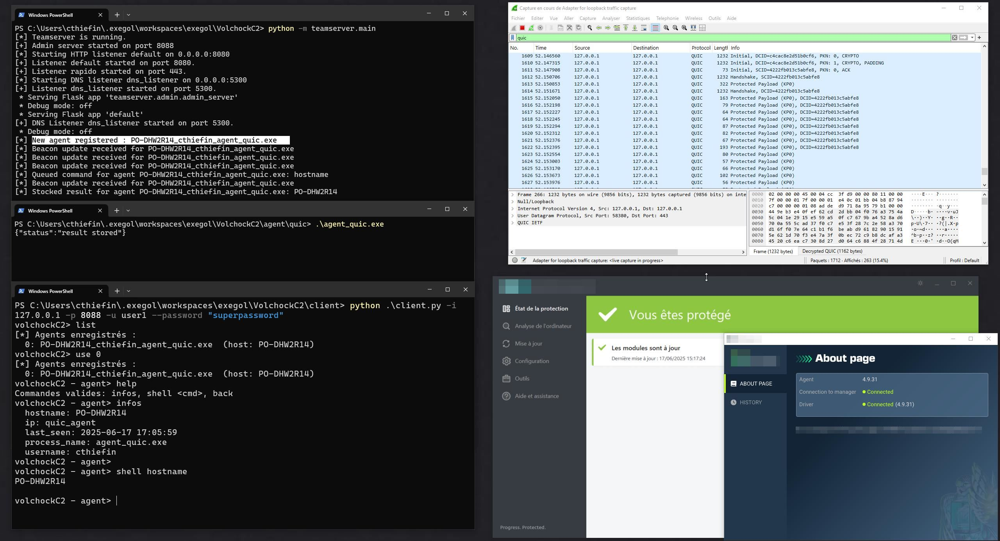
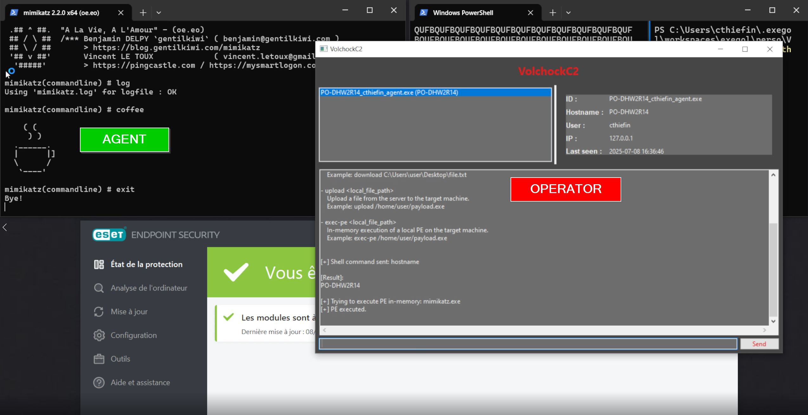

# VolchockC2
VolchockC2 is a custom-built Command & Control (C2) framework, currently under active development. Designed for red team operations and adversary simulation, VolchokC2 focuses on flexibility, stealth, and efficient post-exploitation capabilities.

<p align="center">
  
  <br />
  
</p>


---

## Installation

```
git clone https://github.com/ProcessusT/VolchockC2
cd VolchockC2

# for the teamserver :
python -m teamserver.main --config .\config\config.json

# for the client :
    # CLI client
    python client/client.py -i 127.0.0.1 -p 8088 -u user1 --password superpassword

    # GUI client
    python client/client-gui.py
```

---

## Communication Protocol

### Encryption/Decryption Process

- **Encryption:**  
  `string → xor → base64`
- **Decryption:**  
  `base64 → xor → string`

---

### Communication Content Templates

#### **Agent ➔ Server**

```json
{
    "agent_id": "<ID>",
    "hostname": "<HOSTNAME>",
    "username": "<USERNAME>",
    "process_name": "<PROCESS_NAME>",
    "results": "<RESULTS>"
}
```

#### **Server ➔ Agent**

```json
{
    "task": {
        "<TYPE>": "<CONTENT>"
    }
}
```

#### **Supported Task Types**

- cmd: Execute the content value as a command using cmd.exe and return the result
```json
{
    "task": {
        "cmd": "whoami"
    }
}
```

- download: Download a file from the target machine to the server.
```json
{
    "task": {
        "download": "<remote_file_path>"
    }
}
```

- upload: Upload a file from the server to the target machine.
```json
{
    "task": {
        "upload": "<local_file_path>"
    }
}
```

- exec-pe: In-memory execution of a local PE on the target machine.
```json
{
    "task": {
        "exec-pe": {
            "filename": "<filename>",
            "content": "<b64_encoded_file>",
            "args": "<b64_encoded_args>"
        }
    }
}
```

---

## Implementation Roadmap

### 1. Core Listeners (Communication Channels)
- [x] Implement HTTP listener
- [x] Implement basic DNS listener

### 2. Command & Control Operations
- [x] Implement command execution queue
- [x] Implement upload and download commands

### 3. Multi-Entity Support
- [x] Implement multi-agent support (handle multiple victims/sessions simultaneously)
- [x] Implement multi-user support:
  - [x] The teamserver supports an administrative listening port
  - [x] Develop a client application for operators to connect to the teamserver

### 4. Communication & Evasion Customization
- [x] Implement a configuration/profile file for the teamserver to customize communication parameters
- [ ] Implement agent generation for specific listeners

### 5. Memory & Execution Techniques
- [x] Implement in-memory PE (Portable Executable) execution for C/C++ payloads
- [ ] Implement in-memory PE execution for C# payloads
- [ ] Implement Beacon Object File (BOF) support

### 6. Graphical User Interface (GUI)
- [x] Develop a ugly graphical user interface:
  - [ ] Logs view: teamserver logs
  - [ ] User view: user connections and activity
  - [x] Agent view: list of connected agents with interaction to send commands
  - [ ] Try to make the GUI acceptable

### 7. Advanced features (It will probably never be implemented)
  - [ ] Record all commands and output for each agents (sqlite db maybe ?)
  - [ ] Generation of a shellcode agent
  - [ ] Make contributors rich and famous
  - [ ] Stop all wars in the world


---

## Structure

```
VolchockC2
├── .gitattributes
├── LICENSE
├── README.md
├── agent
│   ├── http
│   │   ├── base64.cpp
│   │   ├── base64.h
│   │   ├── config.h
│   │   ├── crypt.cpp
│   │   ├── crypt.h
│   │   ├── file_utils.cpp
│   │   ├── file_utils.h
│   │   ├── http_client.cpp
│   │   ├── http_client.h
│   │   ├── main.cpp
│   │   ├── pe-exec.cpp
│   │   ├── pe-exec.h
│   │   ├── system_utils.cpp
│   │   ├── system_utils.h
│   │   ├── task.cpp
│   │   └── task.h
│   └── nim
│       └── agent.nim
├── assets
│   ├── demo.jpg
│   └── gui-demo.jpg
├── client
│   ├── client-gui.py
│   └── client.py
├── config
│   └── config.json
├── teamserver
│   ├── __init__.py
│   ├── admin
│   │   └── admin_server.py
│   ├── agents
│   │   └── agent_handler.py
│   ├── config.py
│   ├── encryption
│   │   └── xor_util.py
│   ├── listener
│   │   ├── base_listener.py
│   │   ├── dns_listener.py
│   │   └── http_listener.py
│   ├── main.py
│   ├── profiles
│   │   └── volchock.profile
│   └── teamserver.py
└── tree_map.py
```

---